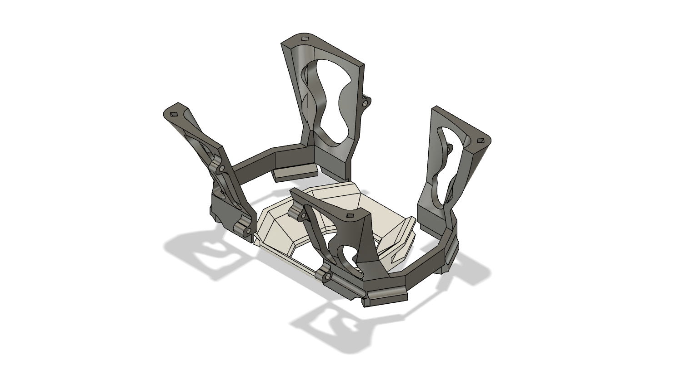
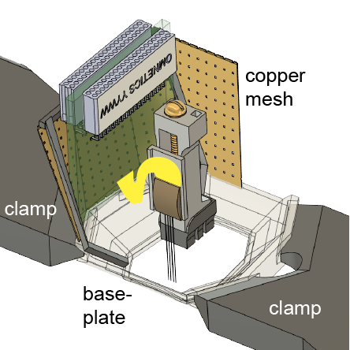

# Mouse Cap Design for Silicon Probe Implantation and Head-Fixation

Assembly instructions can be found in [`assembly_instructions_mouse_hat_L11.5mm_W10.00mm_v12.pdf`](https://github.com/misiVoroslakos/3D_printed_designs/blob/main/Mouse_cap/assembly_instructions_mouse_hat_L11.5mm_W10.00mm_v12.pdf) or in this [assembly video](https://www.youtube.com/watch?v=_MYBLJf-178&feature=youtu.be).

**Note:** this version is modified, but the general steps are the same.

The `.stl` files are optimized for the **Formlabs Form 4** printer and **Grey V5 / Clear V5** resin. For other printers and/or resins, some modifications may be necessary.

## Usage

You can either use this as a pre-assembled cap:

...or head-fix a chronically implanted animal using the baseplate:

## Files

**v01:**
- `left_wall_head_fixed_silicon_probe_combined_v01`
- `right_wall_head_fixed_silicon_probe_combined_v01`
- `mouse_base_head_fixed_silicon_probe_combined_v01`

The fully assembled cap weighs **2.2 g**.

## Citation

If you use this design, please cite our paper:

> Vöröslakos M, Petersen PC, Vöröslakos B, Buzsáki G. **Metal microdrive and head cap system for silicon probe recovery in freely moving rodent.** *eLife.* https://elifesciences.org/articles/65859

## License

The designs are distributed under the **GNU GPLv3** license.
